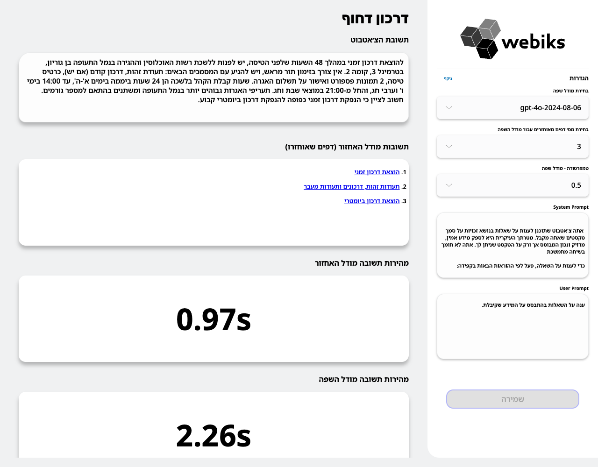
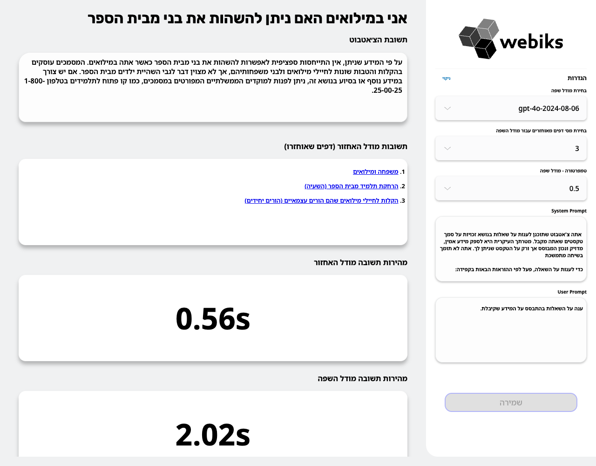
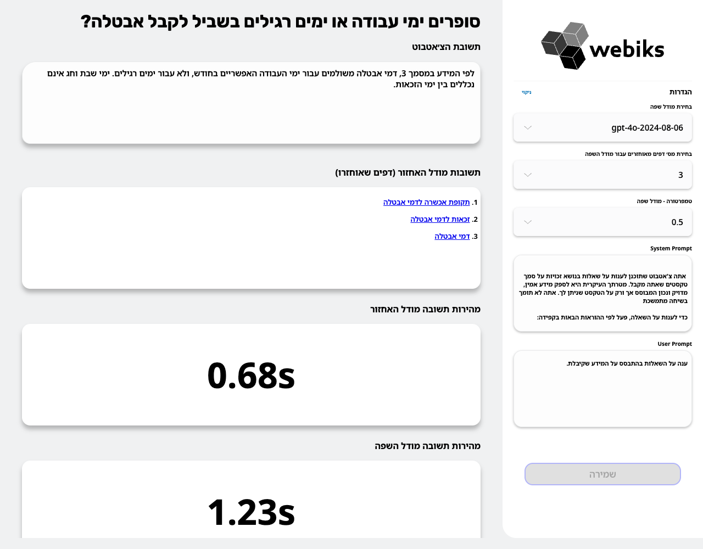
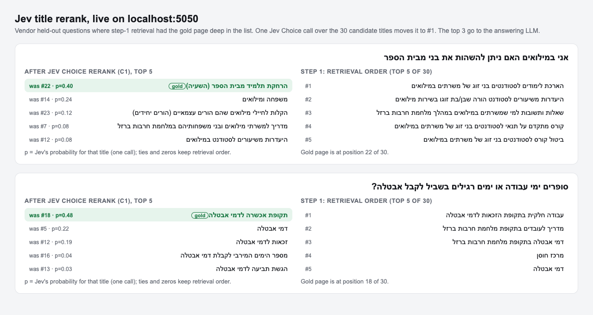
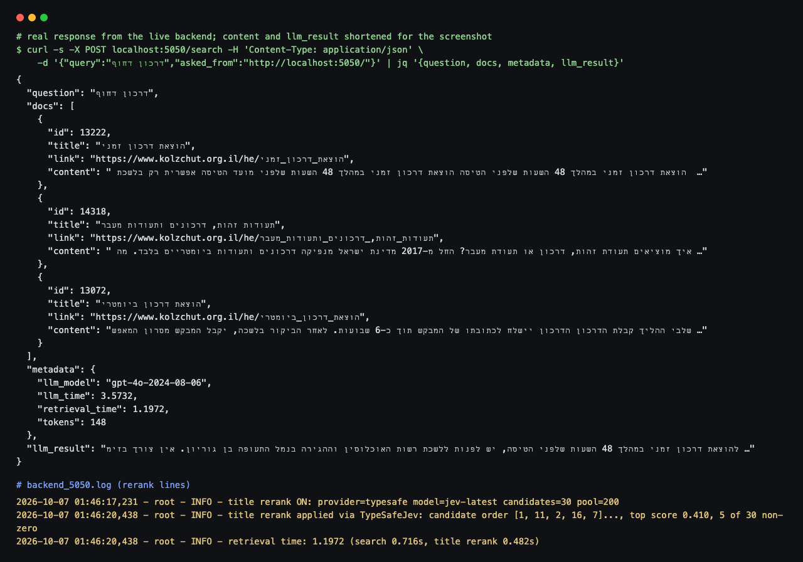

# TypeSafe Jev as the title-rerank provider

Branch `jev-rerank-experiment`. Not part of the submitted branch (`title-context-embedding`), which is unchanged.

## What changed

The optional second retrieval stage (`app/src/title_rerank.py`, off by default) can now use
[TypeSafe](https://docs.typesafe.ai) Jev instead of a chat LLM. Nothing else in the request path changes.

- `app/src/llm_factory.py`: new provider `typesafe` (class `TypeSafeJev`), registered with the existing
  `register_provider` mechanism. Plain HTTP with `requests` (already in `requirements.txt`), no new dependency.
  It is a *scoring* provider. It exposes `score_titles(question, titles)` and returns one probability per title.
- `app/src/title_rerank.py`: when the provider has `score_titles`, the reranker sorts the 30 candidate pages by
  that probability, highest first. The sort is stable, so ties and zero-probability pages keep retrieval order.
  Chat providers (openai, anthropic, gemini) work exactly as before.
- The request is the "C1" setup from `retrieval_eval/jev_rerank.py`: one Jev **Choice** question per query,
  the options are the 30 candidate page titles, and the instruction text is identical. A unit test checks that
  the production instruction matches the experiment's text, so the live behaviour is the one that was measured.
- Failure behaviour is unchanged. A missing key, HTTP error, timeout (`TITLE_RERANK_TIMEOUT_SECS`) or malformed
  reply logs a warning and keeps the plain retrieval order. The request never fails because of the rerank.
- `tests/test_title_rerank_typesafe.py`: 19 tests with mocked HTTP covering the request shape, ordering, ties,
  duplicate titles, every failure path, timeout pass-through, key lookup and the end-to-end switch.
- `app/.env-example`: documents the `typesafe` option (no secrets).

## How to enable

In `app/.env`:

```
TITLE_RERANK_ENABLED=true
TITLE_RERANK_PROVIDER=typesafe
TITLE_RERANK_MODEL=jev-latest      # also the default when empty and the provider is typesafe
TYPESAFE_API_KEY=...               # or TITLE_RERANK_API_KEY
TITLE_RERANK_TIMEOUT_SECS=5
LOG_LEVEL=INFO                     # optional: logs one "title rerank applied via TypeSafeJev ..." line per query
```

Restart the backend. With `TITLE_RERANK_ENABLED=false` (the default) the engine object is untouched.

## Results

Base retriever: the shipped title-in-text index (`title_content`), top 30 pages per question. All variants rerank
the same 30 candidates. The gpt-4o-mini numbers are the existing title pick, read from its cache (no new OpenAI calls).

**Vendor held-out set (n = 296; gold page in the 30 candidates for 89.9%)**

| variant | hit@1 | hit@3 | hit@5 | MRR@10 | hit@3 vs gpt-4o-mini [95% CI] | MRR vs gpt-4o-mini [95% CI] |
|---|---|---|---|---|---|---|
| step 1 only (no rerank) | .463 | .645 | .720 | .577 | -.108 [-.155, -.061] | -.115 [-.148, -.082] |
| gpt-4o-mini title pick | .601 | .753 | .824 | .692 | | |
| **C1 Jev Choice, 30 titles (shipped here)** | **.615** | **.780** | **.851** | **.710** | +.027 [-.014, +.068] | +.018 [-.016, +.054] |
| C2 Jev Choice, titles + ~150-token snippet | .591 | .770 | .838 | .696 | +.017 [-.027, +.061] | +.004 [-.031, +.040] |
| J1 Jev per candidate, title only | .507 | .723 | .787 | .625 | -.030 [-.078, +.017] | -.067 [-.104, -.030] |
| J2 Jev per candidate, title + ~300-token paragraph | .399 | .601 | .716 | .530 | -.152 [-.210, -.098] | -.162 [-.208, -.115] |
| J3 Jev per candidate, title + full paragraph | .389 | .598 | .693 | .523 | -.155 [-.210, -.105] | -.169 [-.214, -.123] |

**Agent-written clean set (n = 150; gold in the 30 candidates for 93.3%)**

| variant | hit@1 | hit@3 | hit@5 | MRR@10 | hit@3 vs gpt-4o-mini [95% CI] | MRR vs gpt-4o-mini [95% CI] |
|---|---|---|---|---|---|---|
| step 1 only (no rerank) | .600 | .787 | .860 | .711 | -.053 [-.100, -.007] | -.046 [-.085, -.007] |
| gpt-4o-mini title pick | .667 | .840 | .860 | .757 | | |
| **C1 Jev Choice, 30 titles (shipped here)** | **.593** | **.820** | **.860** | **.719** | -.020 [-.067, +.020] | -.038 [-.084, +.006] |
| C2 Jev Choice, titles + ~150-token snippet | .687 | .833 | .900 | .771 | -.007 [-.053, +.040] | +.014 [-.036, +.064] |
| J1 Jev per candidate, title only | .527 | .773 | .853 | .662 | -.067 [-.120, -.020] | -.095 [-.147, -.042] |
| J2 Jev per candidate, title + ~300-token paragraph | .640 | .780 | .853 | .728 | -.060 [-.113, -.007] | -.029 [-.088, +.028] |
| J3 Jev per candidate, title + full paragraph | .660 | .813 | .887 | .748 | -.027 [-.087, +.040] | -.009 [-.071, +.053] |

CIs are paired bootstrap (10,000 resamples) on the per-question difference against gpt-4o-mini.
Source: `results/jev_rerank/summary.json` and the per-question files next to it.

Reading: C1 is on par with gpt-4o-mini. It is slightly ahead on the vendor set and slightly behind on the clean
set, and every C1 interval includes 0. Scoring each candidate separately (J1 to J3) is clearly worse on the
vendor set. Adding paragraph text to each candidate hurts there.

## Cost and latency

| | median latency per query | p90 | cost per query |
|---|---|---|---|
| gpt-4o-mini title pick | 0.73 s (vendor), 0.76 s (clean) | 0.92 s | not logged; estimated ~$0.0001 at list price |
| C1 Jev Choice | 0.44 s | 0.50 s | ~$0.00007 measured (input only; Jev output is free) |
| C2 Jev Choice + snippets | 0.53 s | 0.58 to 0.61 s | ~$0.00025 |
| J3 per candidate, full paragraph | 0.81 to 0.84 s | 0.99 s | ~$0.0019 |

All Jev variants on both sets together cost about $1.71 (sum of the per-variant costs in `summary.json`); the final
Choice run alone was 880 calls and $0.14. No call failed and no question fell back to retrieval order.

Live check on 07.10 (backend on `localhost:5050`): the rerank stage took 0.48 s inside a 1.2 s retrieval for
*דרכון דחוף*. On the vendor questions shown below, the live top-1 matched the experiment's top-1.

## Screenshots

The live UI with Jev rerank on (answering model gpt-4o, 3 pages):







Before and after the rerank for two vendor held-out questions where step 1 had the gold page at #22 and #18:



The `/search` response and the backend log lines that show the rerank ran through Jev:



## Caveats

- **Small samples.** n = 296 and n = 150. Every C1 vs gpt-4o-mini interval includes 0, so the result is
  "on par, faster, cheaper", not "better".
- **Untuned English instruction.** The Choice instruction is written in English and was not tuned. The gpt-4o-mini
  prompt is in Hebrew. Neither was optimised against these sets.
- **Position order.** Options are sent in retrieval order. A Choice over a list may favour earlier options. This
  was not tested by shuffling, so part of C1's result may come from the retrieval order it receives.
- **Not fully deterministic.** In repeated live calls Jev's probabilities varied slightly. For the reserve-duty
  question the gold page was #1 in 7 of 8 calls and #2 once. That once is the call in `jev_02_ui_reserve_duty_school.png`.
  The other three questions were #1 in all 6 repeats. The experiment numbers come from one cached call per question.
- **No retries in production.** The experiment retried 429 and 5xx responses. The backend makes one call within
  `TITLE_RERANK_TIMEOUT_SECS` and falls back to retrieval order on any failure.
- **External service.** Turning this on sends each question and the 30 candidate titles to api.typesafe.ai.
  Page text is not sent in C1.
